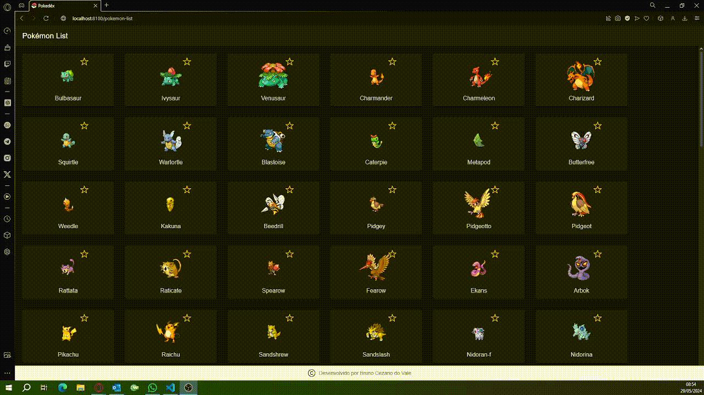

# Pokedex Ionic

Este projeto é uma Pokedex construída utilizando Ionic e Angular. A aplicação permite visualizar uma lista de Pokémons e detalhes individuais sobre cada um deles. Este README fornece uma visão geral do projeto, incluindo como configurá-lo, as funcionalidades implementadas e detalhes específicos sobre a adição de um rodapé fixo.

## Visão Geral

A Pokedex Ionic é uma aplicação web responsiva que permite aos usuários pesquisar e visualizar detalhes sobre diferentes Pokémons. A aplicação consome uma API externa para obter os dados dos Pokémons e exibe esses dados de forma organizada e interativa.

## Funcionalidades

- **Lista de Pokémons**: Exibe uma lista de Pokémons com suas imagens e nomes por ordem de ID. Ao passar o mouse sobre o pokemon, ele exibe algumas informações de status sobre o mesmo.


- **Favoritar Pokémon**: É possível favoritar e desfavoritar seus Pokémons favoritos e o mesmo será posicionado no topo da lista.



- **Detalhes do Pokémon**: Ao clicar em um Pokémon na lista, exibe detalhes adicionais, como altura, peso, experiência base e seu tipo. Permite também voltar a página inicial por meio de um botão configurado no canto superior da página.


- **Rodapé Fixo**: Um rodapé fixo em todas as páginas com o símbolo de "original" e a mensagem "Desenvolvido por Bruno Cezario do Vale".


## Configuração do Ambiente

### Pré-requisitos

Certifique-se de ter os seguintes componentes instalados no seu sistema:

- **Node.js (v14 ou superior)**: [Download Node.js](https://nodejs.org/)
- **NPM (v6 ou superior)**: Incluído com o Node.js
- **Ionic CLI**: Instale globalmente usando `npm install -g @ionic/cli`
- **Git**: [Download Git](https://git-scm.com/)

### Instalação

1. Clone o repositório:
```
git clone https://github.com/brunoVale03/pokedex.git
cd pokedex
```
2. Instale as dependências:
```
npm install
```
3. Execute a aplicação:
```
ionic serve
```
## Estrutura do Projeto
```
  src/
    app/
      home/
      models/
      pokemon-list/
      pokemon-detail/
      services/
      app.component.html
      app.component.scss
      app.module.ts
      app.component.ts
      app-routing.module.ts
      app.component.spec.ts
    assets/
      icon/
        original-icon.png
        pokebola.png
      shapes.svg
    environments/
    theme/
    global.scss
    index.html
```

## Boas Práticas de Codificação
  - Estrutura Modular: A aplicação é organizada em módulos, componentes e serviços para facilitar a manutenção e a escalabilidade.
  - Código Limpo: Esforço constante para manter o código limpo, legível e bem documentado.
  - Responsividade: Garantia de que a aplicação é totalmente responsiva e funciona bem em dispositivos móveis e desktops.
  - Componentes Reutilizáveis: Criação de componentes reutilizáveis para evitar duplicação de código e facilitar futuras expansões.
  - Interatividade: Melhorar a experiência do usuário com interações suaves, como efeitos de hover e transições.

## Conclusão
  Este projeto demonstra uma aplicação completa de Pokedex construída com Ionic e Angular. Ele inclui funcionalidades principais de listagem e detalhamento de Pokémons, pesquisa, e um rodapé fixo com informações de crédito. Seguindo as melhores práticas de desenvolvimento, o projeto é organizado, responsivo e fácil de manter.

## Autor
  Desenvolvido por Bruno Cezario do Vale
